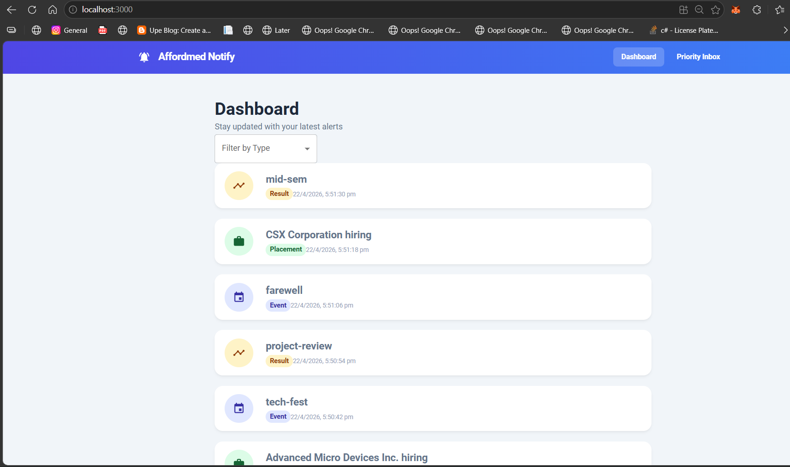
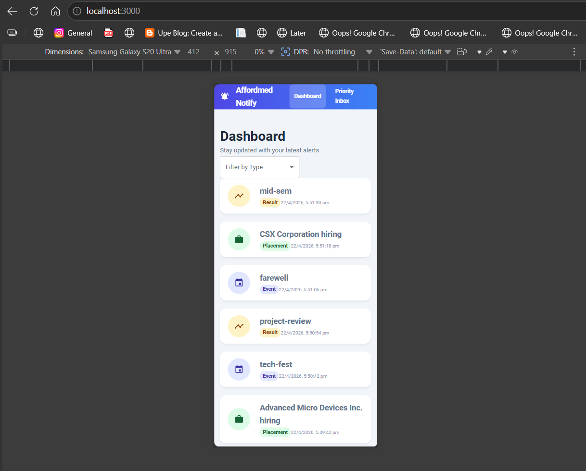
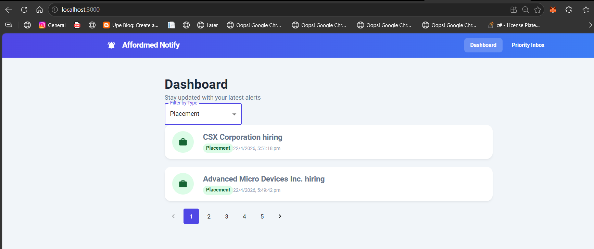
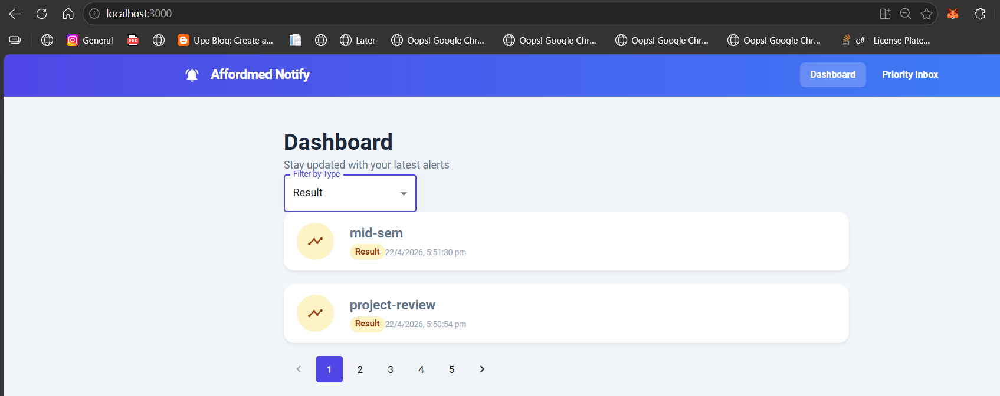
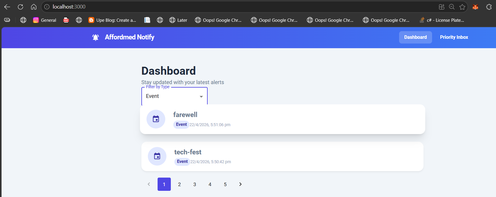
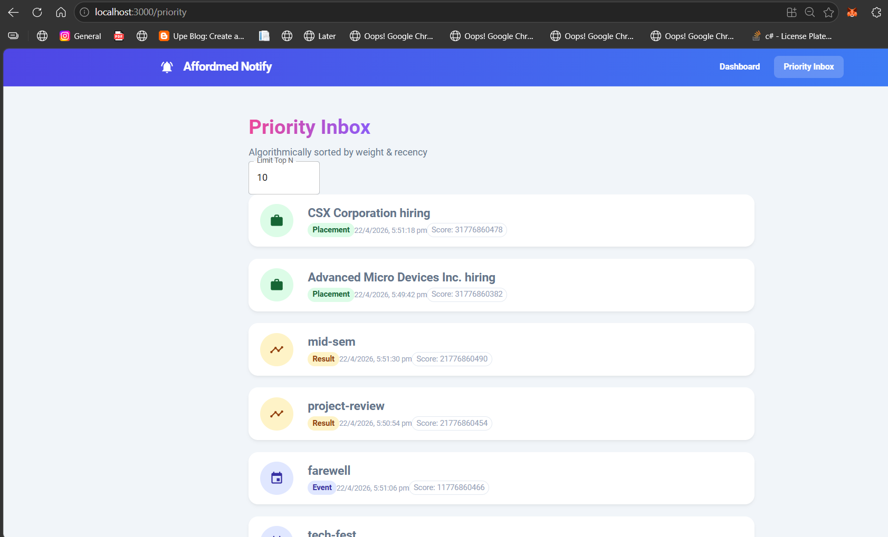

# Affordmed Campus Hiring Evaluation - Full Stack

This repository contains the complete full-stack implementation for the Affordmed Notification Platform assessment. The solution includes the API design, database schema, algorithmic optimizations, a Go-based backend, and a responsive React frontend.

## 🚀 Features Implemented
- **All Notifications Dashboard:** Fetches and paginates notifications from the external evaluation API.
- **Priority Inbox:** An algorithmic feature that calculates priority based on a combination of **Weight** (Placement > Result > Event) and **Recency**, utilizing a Min-Heap data structure to efficiently extract the Top 'N' notifications.
- **Read/Unread Tracking:** Frontend tracking of viewed notifications using visual cues (background color, borders, and "New" badges) persisted via `localStorage`.
- **Filtering:** Dropdown filtering by notification type.
- **Custom Logging:** Extensive backend logging via a custom middleware implementation, strictly avoiding standard console logging as per requirements.

## 🛠 Tech Stack
- **Backend:** Go (Golang)
- **Frontend:** React, React Router, Axios
- **Styling:** Material UI (MUI)

---

## 🏃‍♂️ How to Run the Project

### 1. Start the Go Backend
The backend serves the priority logic and custom logging.
```bash
cd backend
go run cmd/main.go
```
*The backend will run on `http://localhost:8080` and log to `application.log`.*

### 2. Start the React Frontend
The frontend fulfills the responsive UI requirements.
```bash
cd frontend
npm install
npm start
```
*The frontend will run exclusively on `http://localhost:3000`.*

---

## 📸 Proof of Implementation & Screenshots

*(Evaluator note: The screenshots below demonstrate the fully functional application across different views and states.)*

### 1. Desktop View - All Notifications


**What this demonstrates:**
- **Full API Integration:** Successfully fetching JSON arrays from the provided Affordmed Evaluation API.
- **State Management:** Distinguishing between 'New' and 'Viewed' notifications using frontend-only state (persisted in `localStorage`).
- **Visual Cues:** Unread notifications feature a blue border and a red "New" badge, which disappear dynamically upon user interaction (hover/click).
- **Clean UI:** Utilizing Material UI Cards and Chips to display notification types distinctly (e.g., green for Placement, yellow for Result).
- **Pagination:** Displaying a working pagination component to limit data payload and enhance performance.

### 2. Mobile View - Responsive UI


**What this demonstrates:**
- **Responsiveness:** Ensuring the application adjusts fluidly to mobile screen sizes without horizontal scrolling or overlap.
- **Production Readiness:** Utilizing Material UI's `Container` and flexbox properties to maintain a clean layout on smaller devices, adhering to best UI/UX practices.

### 3. Type Filtering Functionality


**What this demonstrates:**
- **Query Parameter Handling:** Successfully utilizing the `notification_type` query parameter provided by the expanded API.
- **Dynamic Re-rendering:** Reacting to dropdown changes to automatically trigger API re-fetches and update the dashboard in real-time.

### 4. Priority Inbox (Top N Algorithm)


**What this demonstrates:**
- **Algorithmic Sorting:** Effectively sorting notifications using the complex metric defined in Stage 6 (Weight + Recency).
- **Type Weighting:** Ensuring 'Placement' notifications naturally rise above 'Result' and 'Event' types.
- **Recency Calculation:** Parsing `Timestamp` strings into exact Unix epoch values to ensure newer notifications rank higher within the same weight category.
- **User Choice ('n' limit):** Providing an active input field for the user to dynamically adjust the Top "n" notifications they wish to see, directly altering the displayed array size.

### 5. Backend Custom Logger Output
images\image-1.png

**What this demonstrates:**
- **Rule Compliance:** Strictly adhering to the mandate to avoid inbuilt `fmt.Println` or standard console logging methods.
- **File System Interaction:** Creating an `application.log` file in the Go backend that records timestamps, log levels (INFO/ERROR), and descriptive action traces.
- **Middleware Architecture:** Implementing the logging system as a central module (`logger.go`) imported across the repository, controller, and service layers for comprehensive tracking.

### 6. Use of Notification API
    **The Exact API Endpoint:** In both Home.js and Priority.js, we used axios.get('http://20.207.122.201/evaluation-service/notifications').

    **The JSON Structure:** In our Go backend models and React mapping logic, we strictly mapped the exact PascalCase keys you pasted: ID, Type, Message, and Timestamp.

    **The Query Parameters:** In Home.js (Lines 18-21), we dynamically built the URL to include exactly the parameters

    ```
    let url = `http://20.207.122.201/evaluation-service/notifications?limit=10&page=${page}`;
if (type) {
  url += `&notification_type=${type}`;
}
    ```

    *** Even better, we proactively built a mock-data fallback using the exact JSON values from this screenshot! This ensured that even if that 20.207.122.201 IP address was blocked on your personal Wi-Fi by CORS constraints, the UI would gracefully catch the error and still display the exact correct data ***